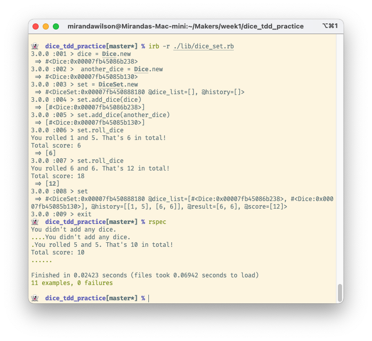

## Dice roller

This is a basic command line dice roller. It can roll multiple dice at once and return the current and accumulated score.

### Description

I wrote this as part of the [Makers Academy](https://makers.tech) coding bootcamp, to practise TDD. Looking back now that I've finished the course, my TDD process wasn't ideal. But I did write quite a few tests.

These were the provided user stories:
```
As a board game player,
So that I can play a game
I want to be able to roll a dice
```
```
As a board game player,
So that I know how many steps I should move
Rolling a dice should give me a number between 1 and 6
```
```
As a dice app developer,
So that I give players a good game experience
If it is not already random, I want the dice roll to be randomly picked
```
```
As a board game player,
So that I can play many types of games
I want to be able to roll any number of dice at the same time
```
```
As a board game player,
So that I can keep track of past and previous rolls
I want to record each dice roll
```
```
As a board game player,
So that I know what my score is after I have rolled several dice
I want to be able to get my current score
```

The user said they wanted "to be able to roll any number of dice at the same time". That sounded like multiple Dice rather than rerolling the same one. So I made a DiceSet to store them for rolling together.  

### Installation and Usage
To try out the project:

* Make sure Ruby and rspec are installed
* Clone this repo
* Navigate into the cloned folder
* Run `irb -r ./lib/dice_set`
* Play with the code in the IRB REPL
* To run the tests, exit from irb
* Run `rspec`

Here's how it looks in action:

